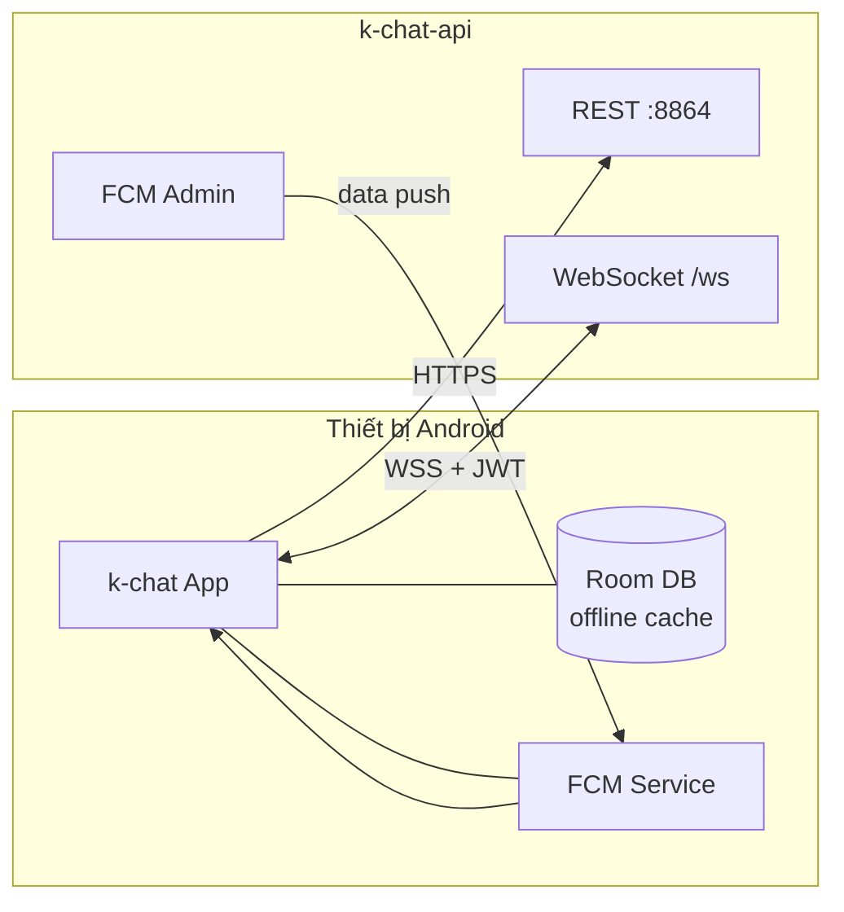
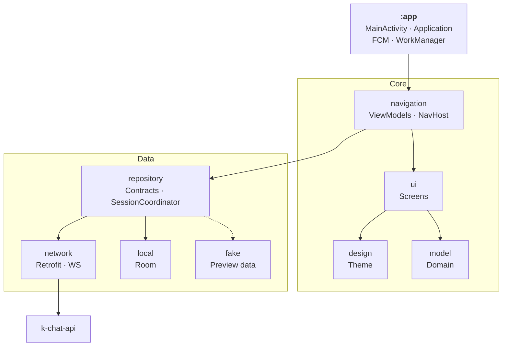
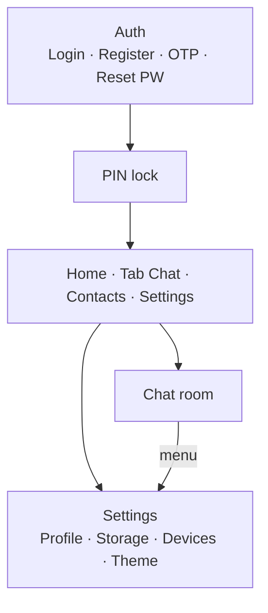
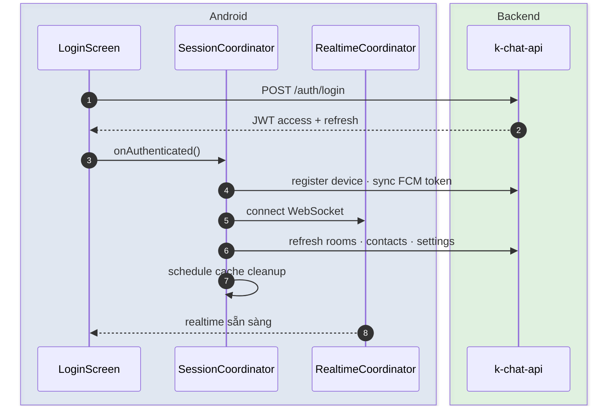
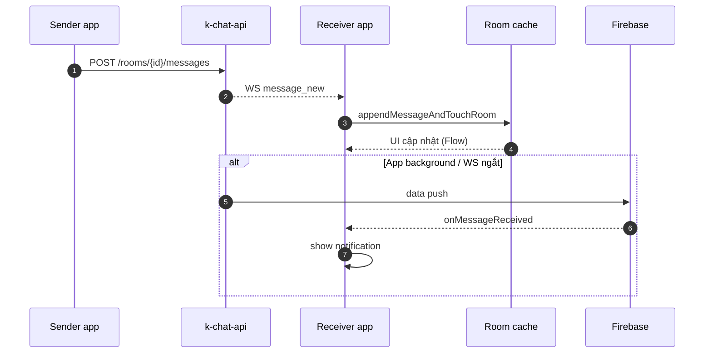
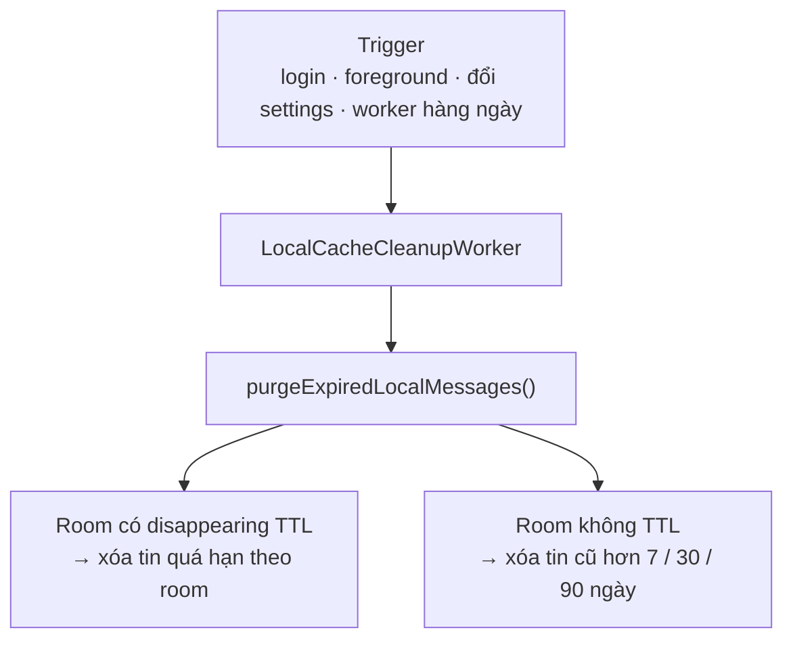
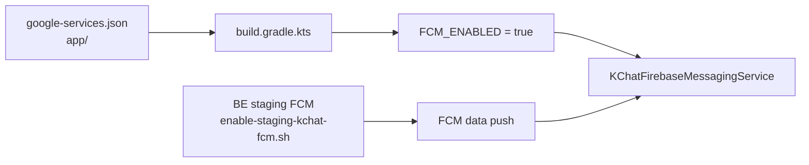
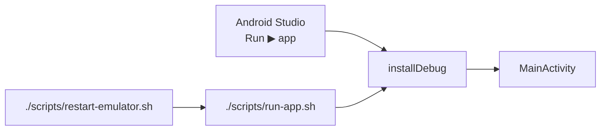

# k-chat Android

> Client chat nội bộ · Jetpack Compose · REST + WebSocket · FCM

| | | |
|:--|:--|:--|
| **Package** | `com.kchat` | **Version** `0.2.0-phase4` |
| **SDK** | min 26 · target 35 | **JDK** 17 |

Mở **`k-chat/android`** trong Android Studio (không phải root `kpay/`).

---

## Tech stack

| Layer | Công nghệ |
|:------|:----------|
| UI | Jetpack Compose · Material 3 · Coil |
| Architecture | MVVM · Hilt · Navigation Compose |
| Network | Retrofit · OkHttp · Kotlin Serialization |
| Realtime | OkHttp WebSocket |
| Local | Room — cache messages & rooms |
| Background | WorkManager — TTL cache cleanup |
| Push | Firebase Cloud Messaging (data-only) |
| Calls | WebRTC — signaling qua WS |
| Build | Gradle Kotlin DSL · KSP |

---

## Vị trí trong hệ thống



> Kiến trúc tổng thể: [`../docs/ARCHITECTURE.md`](../docs/ARCHITECTURE.md) · Backend: [`../backend/README.md`](../backend/README.md)

---

## Kiến trúc module



| Module | Trách nhiệm |
|:-------|:------------|
| `:app` | Entry point · DI root · push · background jobs |
| `:core:design` | Theme, typography, dimens |
| `:core:model` | Models, validation rules |
| `:core:ui` | Compose screens & shared components |
| `:core:navigation` | Routes, NavHost, ViewModels |
| `:data:repository` | Repository interfaces · session · realtime |
| `:data:network` | REST client · WebSocket · mappers |
| `:data:local` | Room entities · DAO · cache purge |
| `:data:fake` | Sample / preview data (Compose previews) |

---

## Navigation app



---

## Luồng chính

### Session sau login



### Nhận tin (online + offline)



### Dọn cache local (#20)



---

## Cấu hình

### API URL

File: [`app/build.gradle.kts`](app/build.gradle.kts) → `buildTypes.debug` / `release`

| Môi trường | Build | REST | WebSocket | Banner login |
|:-----------|:------|:-----|:----------|:-------------|
| **Staging** *(debug mặc định)* | `./gradlew :app:assembleDebug` | `https://chat-api-test.tayjava.net/` | `wss://chat-api-test.tayjava.net` | `Staging` |
| **Local emulator** | `./gradlew :app:assembleDebug -Pkchat.env=local` | `http://10.0.2.2:8864/` | `ws://10.0.2.2:8864` | `Local` |
| **Prod** | `./gradlew :app:assembleRelease` | `https://chat-api.safep4y.com/` | `wss://chat-api.safep4y.com` | *(ẩn)* |

\* Local cần BE `:8864` + seed — xem [`../backend/README.md`](../backend/README.md)

Cleartext HTTP (`10.0.2.2`): [`network_security_config.xml`](app/src/main/res/xml/network_security_config.xml)  
Thiết bị thật + BE local: sửa `kchatLocalApiUrl` trong `build.gradle.kts` thành IP LAN máy host.

### BuildConfig

| Field | Mô tả |
|:------|:------|
| `API_BASE_URL` | Base URL REST |
| `WS_BASE_URL` | WebSocket host |
| `APP_ENV` | `local` / `staging` / `prod` — điều khiển banner |
| `FCM_ENABLED` | Tự `true` khi có `google-services.json` |

### FCM



| | |
|:--|:--|
| File | `app/google-services.json` (package `com.kchat`) |
| Hướng dẫn tạo Firebase | [`../docs/FIREBASE_SETUP.md`](../docs/FIREBASE_SETUP.md) |
| Thiếu file | App chạy bình thường, **không** có push OS |
| BE staging | `./infra/scripts/enable-staging-kchat-fcm.sh` (từ root `kpay/`) |

---

## Build & chạy

**Cần:** Android Studio · JDK 17 · SDK 35 · emulator hoặc device

```bash
cd k-chat/android

./gradlew :app:assembleDebug                         # staging
./gradlew :app:assembleDebug -Pkchat.env=local       # local BE :8864
./gradlew :app:installDebug                          # build + cài device
./gradlew :app:assembleRelease                       # prod APK — chat-api.safep4y.com
```

| Output | Path |
|:-------|:-----|
| APK debug | `app/build/outputs/apk/debug/app-debug.apk` |
| APK release (prod) | `app/build/outputs/apk/release/app-release.apk` |



| Cách | Ghi chú |
|:-----|:--------|
| **Studio** | Run config module `app` (`k-chat.app`) |
| **Script** | `chmod +x scripts/*.sh && ./scripts/run-app.sh` |
| **Emulator lỗi** | `./scripts/restart-emulator.sh` → cold boot |

```bash
# adb not found
export ANDROID_HOME=$HOME/Library/Android/sdk
export PATH=$PATH:$ANDROID_HOME/emulator:$ANDROID_HOME/platform-tools
```

---

## Phân phối & tích hợp BE

App **không deploy server** — build APK nội bộ.

| Việc | Thực hiện |
|:-----|:----------|
| **Prod go-live** | [`PROD_DEPLOY.md`](../docs/PROD_DEPLOY.md) |
| APK prod (nhân viên) | `./gradlew :app:assembleRelease` → `chat-api.safep4y.com` |
| APK debug (staging) | `./gradlew :app:assembleDebug` |
| Deploy API prod | `./infra/scripts/deploy-prod-kchat.sh --wait` |
| Bật FCM prod | `./infra/scripts/enable-prod-kchat-fcm.sh` |

**Release** → prod · **Debug** → staging.

**Smoke test push:** 2 máy · 2 user · receiver ở Home · notification shade.

---

## Xử lý lỗi

| Triệu chứng | Nguyên nhân / xử lý |
|:------------|:--------------------|
| Login fail (staging) | Staging không seed user → **đăng ký mới** |
| Connection refused | BE chưa chạy hoặc sai `API_BASE_URL` |
| Cleartext failed | Chưa bật URL local / thiếu network security config |
| Không có push | Thiếu `google-services.json` · quyền notification · BE FCM off |
| `<no module>` Run | Edit Configurations → Module → `k-chat.app` |
| Gradle sync fail | Mở đúng `k-chat/android` · JDK 17 |

---

## Tài liệu

| | |
|:--|:--|
| Yêu cầu | [`REQUIREMENTS.md`](../docs/REQUIREMENTS.md) |
| QA test cases | [`ANDROID_QA_TESTCASES.md`](../docs/ANDROID_QA_TESTCASES.md) |
| UI plan | [`ANDROID_UI_PLAN.md`](../docs/ANDROID_UI_PLAN.md) |
| Wireframe | [`UI_MOCKUP.md`](../docs/UI_MOCKUP.md) |
| Backend | [`backend/README.md`](../backend/README.md) |
| Backlog | [`BACKLOG.md`](../docs/BACKLOG.md) |
| **Prod deploy** | [`PROD_DEPLOY.md`](../docs/PROD_DEPLOY.md) |
| **Firebase (FCM)** | [`FIREBASE_SETUP.md`](../docs/FIREBASE_SETUP.md) |
